<p align="center">
  
  
  
  
</p>

# 🔐 MERN Auth Methods

A hands-on collection of **production-grade authentication implementations** built with the MERN stack. Each method lives in its own self-contained directory with a complete server (and eventually client), so you can study, compare, and extend them independently.

> **Why this exists:** Most auth tutorials show the happy path. This repo goes further — every method includes CSRF protection, rate limiting, input validation, role-based access control, and centralized error handling out of the box.

---

## 📂 Project Structure

```
mern-auth-methods/
├── 01-session-auth/        # Session-based authentication
│   ├── client/             # React frontend (coming soon)
│   └── server/             # Express + express-session + MongoDB store
├── 02-jwt-scratch/         # JWT authentication built from scratch
│   ├── client/             # React frontend (coming soon)
│   └── server/             # Express + custom JWT (no jsonwebtoken library)
├── 03-oauth-scratch/       # OAuth 2.0 from scratch (🚧 in progress)
│   ├── client/
│   └── server/
└── Illustrations/          # Architecture diagrams (SVG)
```

---

## 🔑 Authentication Methods

### 01 — Session-Based Authentication

The classic server-side session approach. The server creates a session on login, stores it in MongoDB via [`connect-mongo`](https://www.npmjs.com/package/connect-mongo), and sends back a `connect.sid` cookie.

| Feature | Detail |
|---|---|
| **Session Store** | MongoDB (`connect-mongo`) |
| **Password Hashing** | bcryptjs (12 rounds) |
| **CSRF Protection** | Double-submit cookie (`csrf-csrf`) |
| **Rate Limiting** | 100 req / 15 min on auth routes |
| **API Docs** | Swagger UI at `/api-docs` |
| **Security Headers** | Helmet |
| **Roles** | `user` / `admin` with middleware guards |

<details>
<summary><strong>API Endpoints</strong></summary>

| Method | Route | Description | Auth |
|--------|-------|-------------|------|
| `POST` | `/api/auth/register` | Register a new user | ✗ |
| `POST` | `/api/auth/login` | Log in (creates session) | ✗ |
| `POST` | `/api/auth/logout` | Destroy session | ✓ |
| `GET`  | `/api/auth/me` | Get current user | ✓ |
| `GET`  | `/api/auth/csrf-token` | Obtain CSRF token | ✗ |
| `GET`  | `/api/user/profile` | Get own profile | ✓ |
| `PUT`  | `/api/user/profile` | Update profile | ✓ |
| `PUT`  | `/api/user/password` | Change password | ✓ |
| `DELETE`| `/api/user/account` | Delete account | ✓ |
| `GET`  | `/api/admin/users` | List all users | Admin |
| `PUT`  | `/api/admin/users/:id/role` | Change user role | Admin |
| `DELETE`| `/api/admin/users/:id` | Delete a user | Admin |

</details>

---

### 02 — JWT Authentication (From Scratch)

No `jsonwebtoken` library — the JWT `sign()` and `verify()` functions are [**implemented manually**](./02-jwt-scratch/server/lib/jwt.js) using Node.js `crypto` with HMAC-SHA256. Tokens are stored in **httpOnly cookies**, not localStorage.

| Feature | Detail |
|---|---|
| **Token Type** | Custom JWT (HS256 via `crypto`) |
| **Token Storage** | httpOnly, sameSite cookies |
| **Password Hashing** | bcrypt (native) |
| **CSRF Protection** | Double-submit cookie (`csrf-csrf`) |
| **Rate Limiting** | 100 req / 15 min on auth routes |
| **Security Headers** | Helmet |
| **Roles** | `user` / `admin` with middleware guards |

<details>
<summary><strong>Custom JWT Implementation Highlights</strong></summary>

- **Base64URL encoding/decoding** — handles `+`, `/`, `=` replacements per RFC 7515
- **`sign(payload, secret, options)`** — creates `header.payload.signature` with configurable expiry (`'1h'`, `'7d'`, or seconds)
- **`verify(token, secret)`** — re-computes HMAC signature, compares, and checks `exp` claim
- **No third-party JWT dependency** — purely `crypto` module

</details>

---

### 03 — OAuth 2.0 (From Scratch) 🚧

> **Status:** Scaffolding in place — Express server with basic routing. Full OAuth 2.0 Authorization Code flow implementation is in progress.

---

## 🛡️ Security Features (All Methods)

Every implementation shares a security-first baseline:

- **CSRF Protection** — Double-submit cookie pattern via [`csrf-csrf`](https://www.npmjs.com/package/csrf-csrf)
- **Rate Limiting** — [`express-rate-limit`](https://www.npmjs.com/package/express-rate-limit) on sensitive routes
- **Security Headers** — [`helmet`](https://www.npmjs.com/package/helmet) applied globally
- **Password Safety** — bcrypt/bcryptjs hashing, passwords excluded from query results (`select: false`)
- **Input Validation** — Server-side validators for registration and profile updates
- **Centralized Error Handling** — Consistent JSON error responses
- **Role-Based Access Control** — `user` and `admin` roles with middleware enforcement

---

## 🚀 Getting Started

### Prerequisites

- **Node.js** ≥ 18
- **MongoDB** (local instance or [Atlas](https://www.mongodb.com/atlas))

### Setup (per method)

Each method is independent. Pick the one you want to run:

```bash
# Example: Session-based auth
cd 01-session-auth/server
npm install
```

Create a `.env` file:

```env
PORT=5000
MONGODB_URI=mongodb://localhost:27017/session-auth
SESSION_SECRET=your-super-secret-key       # 01-session-auth
JWT_SECRET=your-jwt-secret-key             # 02-jwt-scratch
```

Start the dev server:

```bash
npm run watch
```

> **Session Auth** serves Swagger docs at [http://localhost:5000/api-docs](http://localhost:5000/api-docs)

---

## 🧰 Tech Stack

| Layer | Technology |
|-------|-----------|
| Runtime | Node.js |
| Framework | Express 5 |
| Database | MongoDB + Mongoose 9 |
| Security | Helmet, csrf-csrf, express-rate-limit |
| Auth (01) | express-session + connect-mongo |
| Auth (02) | Custom JWT (Node.js `crypto`) |
| Auth (03) | OAuth 2.0 (WIP) |
| Docs | Swagger / OpenAPI 3.0 |
| Dev | Nodemon |

---

## 📊 Architecture

<p align="center">
  
</p>

---

## 🗺️ Roadmap

- [x] Session-based authentication (server)
- [x] JWT from-scratch authentication (server)
- [ ] OAuth 2.0 from-scratch (server)
- [ ] React client for each method
- [ ] Refresh token rotation (JWT)
- [ ] Social login providers (OAuth)
- [ ] Deployment guides (Docker, Railway, Vercel)

---

## 📄 License

This project is licensed under the ISC License.

---

<p align="center">
  Built for learning. Hardened for production. 🛡️
</p>
